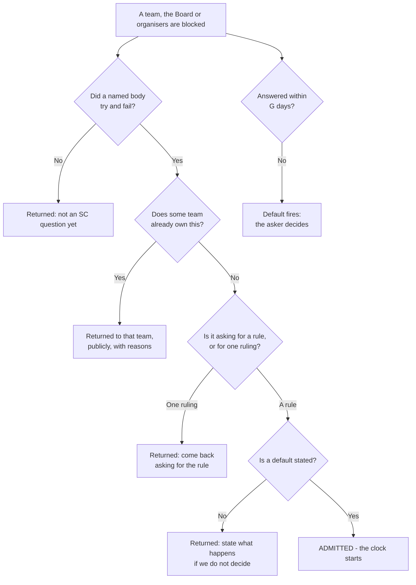
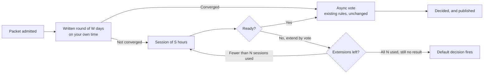
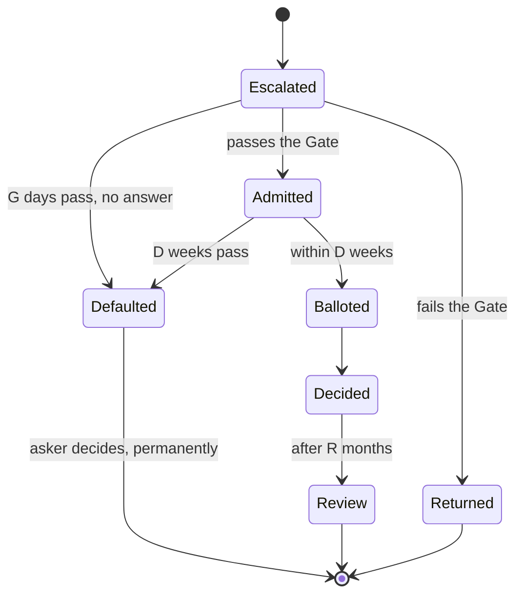

# Decision Process

[async-voting.md](./async-voting.md) already governs which governs how a vote is run and which this process hands off to unchanged.
This document deals with the matters of:

- What is the SC's role in community decisions
- What questions are eligible for an SC vote
- How long may the decision process take

## Problems that this process solves which already have precedents:

### 1. The SC works on random questions because there is no gate

- [Examples of non-SC questions in SC logs](https://github.com/NixOS/steering-committee/blob/main/minutes/2026-04-15.md)
- same meeting: "(SC Member): doesn't know if this count, but we should post community updates" appears three times, twice annotated "(SC member) brought this up again here."
- ["the delegation problem remains, regardless of the people doing it. Not having a good process is an SC problem."](https://github.com/NixOS/steering-committee/blob/main/minutes/2026-04-22.md)
- [vote 0016: "I consider that this issue is more of a Foundation + Organizer issue than it is a SC issue."](https://github.com/NixOS/steering-committee/blob/main/vote-logs/0016-sponsorship-tier-integrity.md)

### 2. Discussions have no end-condition and not necessarily lead to a vote/decision

- The minutes of [2026-01-07](https://github.com/NixOS/steering-committee/blob/main/minutes/2026-01-07.md) literally read # Old topics (~20~ 50 min): the timebox crossed out inside the document.
- The AI policy was raised on [2026-03-25](https://github.com/NixOS/steering-committee/blob/main/minutes/2026-03-25.md) and appears in at least six meetings after that. On [2026-05-13](https://github.com/NixOS/steering-committee/blob/main/minutes/2026-05-13.md) "By next week, let's all have addressed this fully, so we can vote on roberts policy." The next week's notes contain nothing on it. It has still never been voted on.
- The moderation team rebuild appears in 14 of the 17 published minutes, from November 2025 onward, deferred again and again: "Vote deferred" ([2025-11-05](https://github.com/NixOS/steering-committee/blob/main/minutes/2025-11-05.md)), "deferred from 12/31 meeting… Deferred to 2026-01-14" ([2026-01-07](https://github.com/NixOS/steering-committee/blob/main/minutes/2026-01-07.md)). [2026-04-08](https://github.com/NixOS/steering-committee/blob/main/minutes/2026-04-08.md): "we're now ~6 months into the SC cycle and from the outside it looks like nothing has happened on moderation."
- One absent member stalls decision making: [2026-03-25](https://github.com/NixOS/steering-committee/blob/main/minutes/2026-03-25.md) contains three separate "move to table" motions, one of them "because (SC Member) is not here."

### 3. not deciding is free, so it is what happens

[Vote 0011](https://github.com/NixOS/steering-committee/blob/main/vote-logs/0011-meeting-note-sla.md) proposed that meeting notes become mergeable after five days even without review, so publication would stop being blocked.

The result: 1 yes, 0 no, 6 abstain.

"I am inclined to vote yes on this", "I'm in agreement with the spirit of this." It failed anyway, because under the current rules abstaining is free and costs nothing.

### 4. SC does micro-management instead of general policies

This is related to 3.), postponed decisions.

If the SC stalls on a given question but pressing issues need to be decided, government defaults to micro-management to unblock team decisions in a non-sustaining way.

- [vote 0010](https://github.com/NixOS/steering-committee/blob/main/vote-logs/0010-delist-helsing-hiring-post.md)
  - "We should have a unified policy towards defense contractors… it is much cleaner, and much less geopolitically contentious to have a blanket ban." Both dissenters agree on that point.
  - "we have no clear rules --- we could not agree on any.", "Be consistent… Be explicit if policy is changing.", "I'm explicitly abstaining. I have no coherent position."
- [vote 0016](https://github.com/NixOS/steering-committee/blob/main/vote-logs/0016-sponsorship-tier-integrity.md) governs whether tiers may be split between companies.
  - Micromanagement: This decision was not made because the Nixcon organizers were unable to decide for themselves, but rather overturns a team decision that had already been made.
- [vote 0013](https://github.com/NixOS/steering-committee/blob/main/vote-logs/0013-nixcon20206-sponsorship-1.md) alone contains four separate sponsor ballots, one per company.
  - [2026-05-13](https://github.com/NixOS/steering-committee/blob/main/minutes/2026-05-13.md) another sponsor is waved through with "(the room was silent): unanimous approval". Every one is a fresh judgment call where a single published prospectus rule would have done.
  - "my vibe check is that this would be contentious."

Deferring a hard question does not make it go away.
It makes it come back, at a worse time, with less trust available.
The SC's very reason to exist is delivering difficult decisions with the authority of democratic community representation.

### 5. Complicated review of Representation by Voters

If questions are stuck in indefinite log streams, it becomes hard to review individual SC members.

Without a formal process, it is difficult who came up with a question ("the group" cannot be made accountable), why it was not voted on, and SC members can always claim that certain parts of the discussion happened in their absense.

## Process Principles

### 1.) Elected judgment is the scarce resource. Spend it, don't waste it.

The SC is valuable because seven elected people can make a call that the community will accept as legitimate.
Representing the community should not require sitting in endless meetings without a result.

### 2.) Deciding *at all* beats a perfect decision that is never made

Thisis easy to mishear as an insult and it is not meant as one:
SC members are not elected because they are more likely to find the perfect compromise that everybody else missed.
Specialist teams will understand their challenges better than the SC does.

What the SC has that no team has is a **mandate**.
It was voted in by the community.
The same community now has to accept its answers if no other instance in the community was able to decide on a matter.

## The Process

### 1. Variables

Every number in this process is a named variable, defined here and used as a symbol everywhere
below. Values appear in this table and nowhere else.

| Symbol | Dial | Unit | Value |
| :---: | --- | :---: | :---: |
| **N** | Sessions before the Default fires | sessions | 3 |
| **S** | Length of one session | hours | 1 |
| **G** | Chairperson's answer window at the Gate | days | 7 |
| **W** | The written round | days | 7 |
| **D** | From admitted packet to ballot | weeks | 3 |
| **P** | Publishing each round's outcome | days | 1 |
| **R** | How long a decision stands | months | 12 |
| **T** | Review interval for this process | months | 3 |

The numbers can be changed if any time window turns out too tight or too loose without changing hte process.

### 2. What questions does the SC handle

1. A question is SC work if it was **escalated through the Gate** ([§4](#4-the-gate)) and admitted.
2. Otherwise, it can only be on the SC agenda if it is one of these matters:
   - elections, seats, and vacancies
   - coordination with the Foundation Board
   - [Steering teams](./team-steering.md)
   - the SC's own process rules

Anything else is not SC work:
If it did not come through the Gate and is not on the list above, the SC does not take it up.

### 3. Who may initiate SC decisions

1. A team, the Board, event organisers, or a working group.
   Escalation goes through the one person responsible for it, so there is always one name attached.

- Individuals cannot escalate on their own:
  If you are not part of the group that has to live with the answer and do the work that follows it, the SC is not where your question belongs.
   Convince the team/people who do that work first.
- If a body's responsible person refuses to escalate, that is not an escalation about the topic.
  It is a question about whether the right person is responsible, which is on the closed list in [§1](#2-what-questions-does-the-sc-handle)

### 4. The gate

Minimal gatekeeping is needed to shield the SC from non-SC questions and misuse of power/position.

A question reaches the SC only if it passes four tests:

1. **A named body is blocked**:
   A team, the Board, or an event's organisers tried to decide and could not, and says so in writing through the person responsible for it.
   (Not: an individual is unhappy with an outcome)
2. **Nobody else may decide it**:
   The question crosses team boundaries, or no team owns it.
   If a team does own it, the SC hands it back and says so publicly.
3. **Question asks for a rule, not a ruling**:
   The answer must settle this case and must be able to settle "the next ten".
   If the SC has already ruled on this class of question, only "change the rule" may be escalated.
4. **The question comes with a default answer recommendation**:
   What should happen if the SC fails to decide in time.
   No default written down, no admission.

Time and process constraints:

1. The current chairperson (typically rotating) answers within **G** days (public logs, written reason).
2. Any two SC members can overturn a rejection
3. No answer within G days: Default answer of the question triggers

### 5. Presentation of SC questions

A question is admitted as a **decision packet**, written by whoever is escalating it:

| Section | Content |
| --- | --- |
| The question | One sentence |
| Who is blocked | Who is affected? What cannot proceed today? |
| Options | 2 to 4 concrete options. Each written as motion text. The SC can (but does not have to) vote on it as-is. |
| Trade-offs | What each option costs and breaks. Question-initiator's own words. |
| Default decision | What happens if the SC does not decide by the deadline? |

1. The SC's job is to pick, amend, or reject.
   Never to draft from a blank page.
2. An incomplete packet is returned by the chairperson.
   Returning it is a Gate answer and is subject to the same **G** day limit.

See the [template](#appendix-packet-template) for a complete packet.

### 6. Time constraints

Members respond to a packet in writing, on their own time within the time limit.
Meetings happen only if writing did not settle it.

1. **Written round lasts W days**:
   If it converges, the motion goes straight to the existing vote procedure.
2. **Ceiling: N sessions of S hours, within D weeks**:
   That is N*S hours of committee time per question, total.
3. Sessions after the first happen only if the SC explicitly extends, **by recorded vote**, and
   each extension is logged.
4. **The last session, session N, is final wording only**: The framing cannot be reopened.
5. **Absence does not stop the clock, and does not reopen settled text**:
   If initial SC members miss a written answer or session, they give up the right to reopen what was settled in it.
   They keep every other right, including the vote.
6. The motion then continues with [async-voting.md](./async-voting.md)

### 7. Default decision

The default decision is formulated by a domain expert who will have to work with it and is the ultimate prevention of a deadlock.

The default that the asker wrote down **takes effect automatically** in either of two cases:

1. **The Gate is not answered within G days**
2. **D weeks pass after admission with no decision**

Authority over that class of question returns to the asker permanently.
The log records:

> **SC did not decide.** Authority returns to *[the asker]*. Participation: *[per member]*.

### 8. Public records

1. Every admitted packet gets a **public file from day one**:
   question, asker, options, default, deadline, and each round's outcome.
2. Each round's outcome is published within **P** days.
3. Every member's position and vote is public, with their reason.
4. **Four things may be withheld**, and nothing else: individual moderation cases, legal advice,
   member privacy matters, and contract negotiations.
   Each redaction is logged as a line item with a reason.
   **The existence of a redaction item is always public.**
5. Video recordings and verbatim transcripts are not required.

### 9. (Lack of) participation

1. **A written position counts exactly as much as attending.**
   Nobody is penalised for missing a call.
2. **Abstaining requires a one-line reason**.
   Abstaining stays generally allowed.
3. **A capacity check** triggers automatically if a member misses final ballots on more than half of a quarter's decided questions.
   They publish a short note saying whether they are continuing or stepping back.
4. **This process cannot remove anyone.** Removal is a constitutional matter and lives outside a process rule the SC adopts by majority.

### 10. Finality of decisions

1. A decision **stands for R months**.
   Within that period it is not re-litigated.
2. Every decision can only be review by a gated appeal after **R months**.
3. Before then, reopening requires **genuinely new facts**.

## Appendix: SC question template

Copy this shape.

> **Question:** May companies whose primary business is weapons or defense systems sponsor NixOS
> events?
>
> **Who is blocked:** NixCon organisers cannot answer sponsors without a rule. Loud members press for making individual calls with no objective policy behind them. Two decisions have already been made case-by-case, in opposite directions, six months apart.
>
> **Option A.** *"NixOS platforms and events do not accept sponsorship from companies whose primary business is the manufacture of weapons or defense systems."*
>
> **Option B.** *"NixOS platforms and events accept sponsorship and job postings from any lawful
> company. Industry is not relevant for for exclusion."*
>
> **Option C.** *"NixOS platforms and events apply one published, objective exclusion list.
> Companies not on it are accepted on the same terms as everyone else."*
>
> **Trade-offs:** A is predictable and loses some funding; part of the community will call it
> political. B is predictable, unpolitical and maximises funding; part of the community will be angry, loudly.
> C is the most work to maintain and the hardest to keep consistent, but it moves the argument to
> the list which can be reviewed in fixed intervals, instead of per sponsor.
>
> **Default if the SC does not decide:** NixCon organisers apply their own written prospectus,
> and the SC does not review individual sponsors again.
